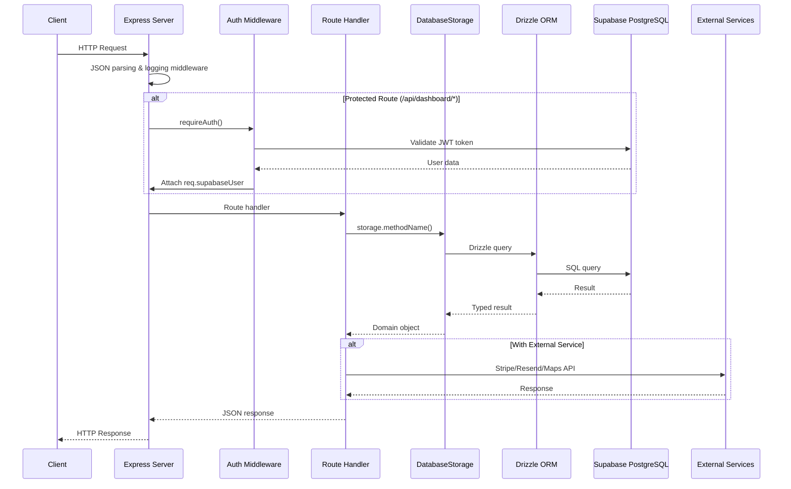
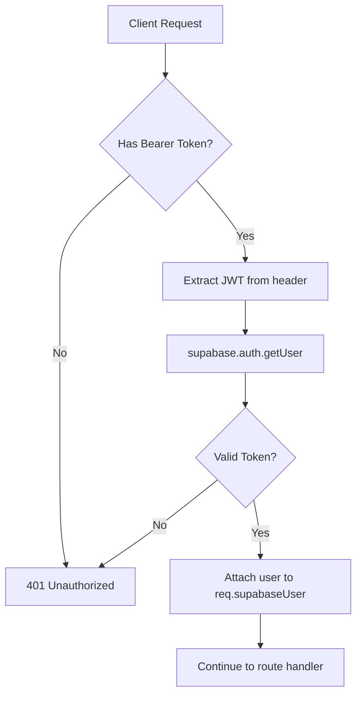
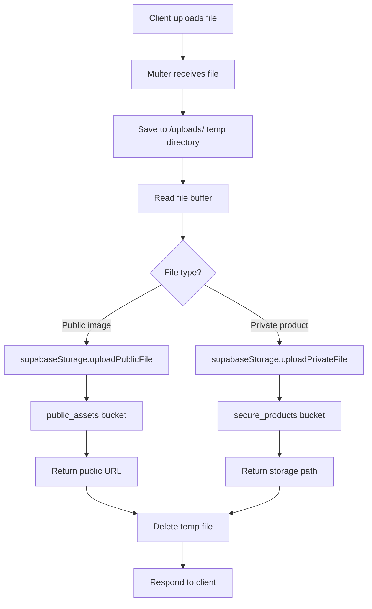
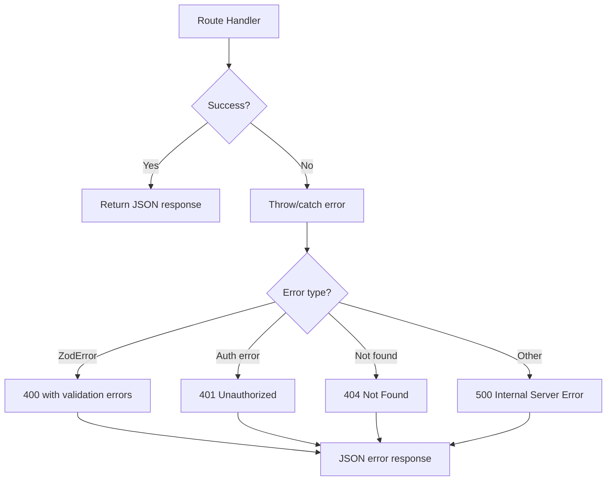

# Server Data Flow

## Overview

The server layer (`backend/`) is an Express.js application that handles API requests, authentication, file storage, and database operations. It serves both the REST API and the frontend (via Vite in development, static files in production).

---

## Request Lifecycle



---

## Core Design Patterns

### 1. Repository Pattern (Storage Layer)

The `storage.ts` file implements an `IStorage` interface with a `DatabaseStorage` class. This abstracts all database operations behind a clean API.

```
IStorage (interface)
    └── DatabaseStorage (implementation)
            └── db (Drizzle ORM instance)
                    └── Supabase PostgreSQL
```

**Benefits:**
- Single source of truth for all DB queries
- Easy to mock for testing
- Consistent error handling and soft-delete patterns

### 2. Middleware Chain

```
Request → JSON Parser → Logging → Auth (optional) → Route Handler → Response
```

| Middleware | File | Purpose |
|------------|------|---------|
| `express.json()` | `index.ts` | Parse JSON request bodies |
| Request logger | `index.ts` | Log API requests with timing |
| `requireAuth` | `supabaseAuth.ts` | Validate JWT, attach user to request |
| `optionalAuth` | `supabaseAuth.ts` | Attach user if token present, continue if not |
| Error handler | `index.ts` | Catch errors, return JSON response |

### 3. Service Pattern (External Integrations)

External services are encapsulated in dedicated modules:

| Service | File | Purpose |
|---------|------|---------|
| `supabaseStorage` | `supabaseStorage.ts` | File uploads to Supabase Storage buckets |
| `emailService` | `emailService.ts` | Send emails via Resend API |
| Stripe | `routes.ts` (inline) | Payment processing |

---

## Authentication Flow



**Key Points:**
- JWT tokens are issued by Supabase Auth
- Backend validates tokens using Supabase Admin SDK (service role key)
- User ID from JWT matches `profiles.id` in database

---

## Database Communication

### Connection Setup (`db.ts`)

```
Environment Variable: SUPABASE_DATABASE_URL
         ↓
    Neon Serverless Pool
         ↓
    Drizzle ORM (with schema)
         ↓
    Typed queries
```

### Query Flow

1. Route handler calls `storage.methodName()`
2. Storage method uses Drizzle query builder
3. Drizzle generates SQL, executes via Neon pool
4. Results are typed according to `shared/schema.ts`

### Soft Delete Pattern

Most entities use soft delete (`isActive: false`) rather than hard delete:

```typescript
// Soft delete example
async deleteDigitalProduct(id: number): Promise<void> {
  await db
    .update(digitalProducts)
    .set({ isActive: false, updatedAt: new Date() })
    .where(eq(digitalProducts.id, id));
}
```

---

## File Upload Flow



**Storage Buckets:**
| Bucket | Access | Use Case |
|--------|--------|----------|
| `public_assets` | Public | Profile images, blog images, gallery |
| `secure_products` | Private | Paid digital product files |

---

## API Route Structure

### Public Routes (no auth required)
```
GET  /api/config/supabase       → Supabase public credentials
GET  /api/geolocation           → IP-based location detection
GET  /api/profiles/:username    → Public creator profile
GET  /api/profiles/:username/*  → Products, blog, events, sessions
POST /api/create-payment-intent → Stripe payment processing
```

### Protected Routes (requireAuth middleware)
```
GET/POST/PATCH  /api/dashboard/profile     → Own profile management
GET/POST/PATCH/DELETE /api/dashboard/*     → Products, blog, events, sessions, bookings
POST /api/upload/image                     → File uploads
GET/POST/PATCH/DELETE /api/locations/*     → Location management
```

---

## External Service Integration

### Stripe (Payments)
- Initialized from `STRIPE_SECRET_KEY` env var
- Used for payment intents on bookings, products, events
- Currently includes mock fallback when Stripe not configured

### Resend (Email)
- Fetches API key from Replit connector or environment
- Sends verification, password reset, and welcome emails
- Falls back to console logging when not configured

### IP Geolocation
- Uses `ipapi.co` (primary) and `ip-api.com` (fallback)
- Detects user location from IP for profile display
- Handles private/reserved IP ranges gracefully

### Google Maps
- URL expansion for short `maps.app.goo.gl` links
- Frontend uses Maps JavaScript API for location picker

---

## Error Handling



---

## Development vs Production

| Aspect | Development | Production |
|--------|-------------|------------|
| Frontend serving | Vite dev server with HMR | Static files from `dist/public` |
| Logging | Verbose with request timing | Same |
| Port | 5000 | 5000 |
| Database | Supabase (same as prod) | Supabase |

---

## Key Files Summary

| File | Lines | Responsibility |
|------|-------|----------------|
| `index.ts` | 75 | Express app setup, middleware, server start |
| `routes.ts` | ~3500 | All API endpoint definitions |
| `storage.ts` | ~1265 | Database access layer (IStorage implementation) |
| `db.ts` | 46 | Drizzle ORM connection setup |
| `supabaseAuth.ts` | 124 | JWT validation middleware |
| `supabaseStorage.ts` | 133 | File upload/download service |
| `emailService.ts` | 243 | Email sending via Resend |
| `vite.ts` | 86 | Vite dev server integration |
