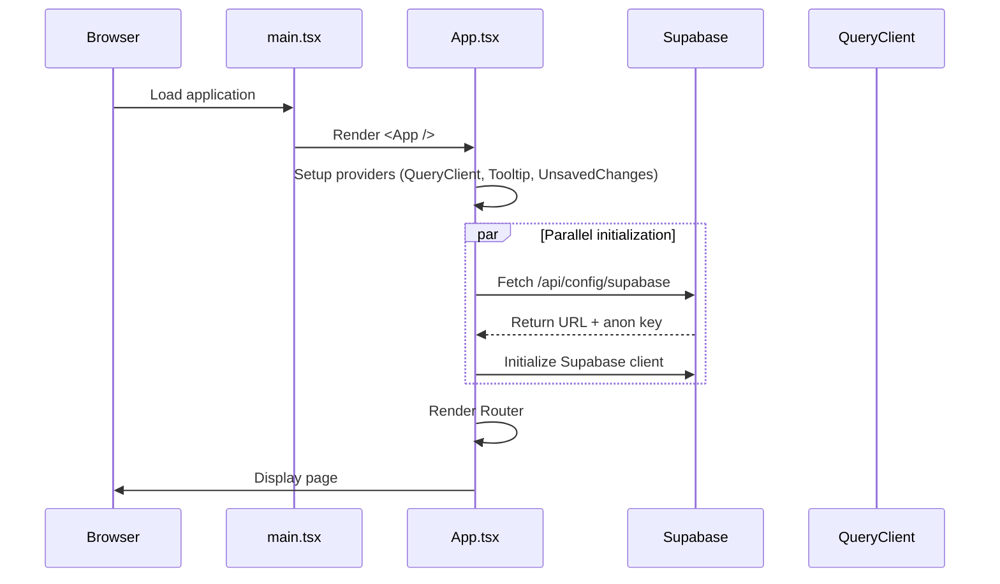
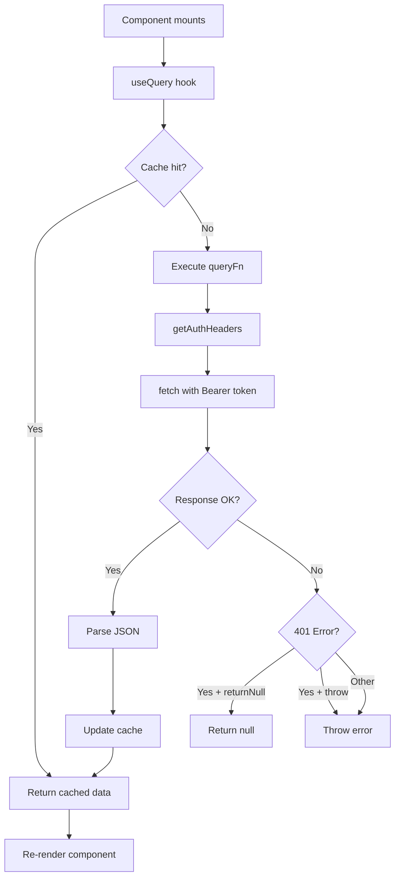
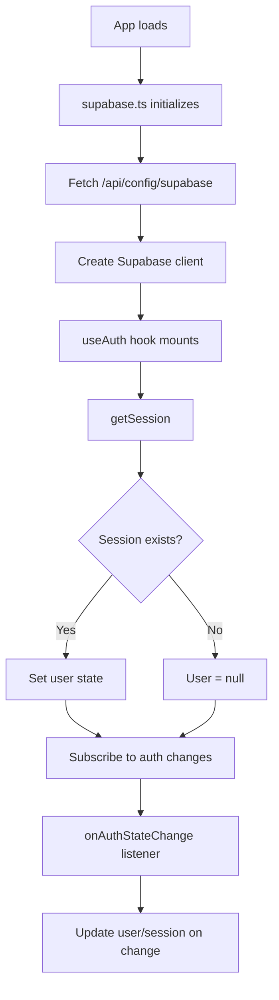
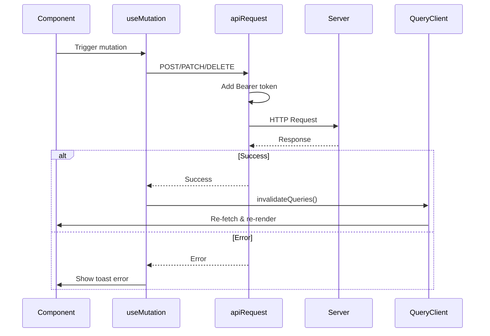
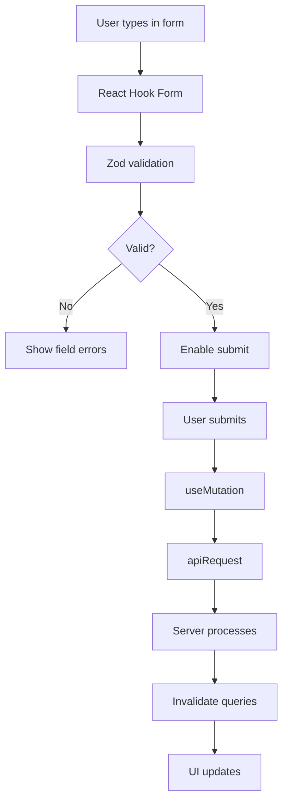
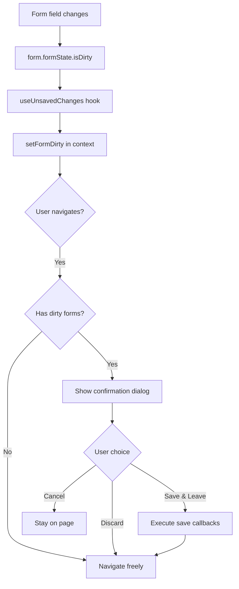
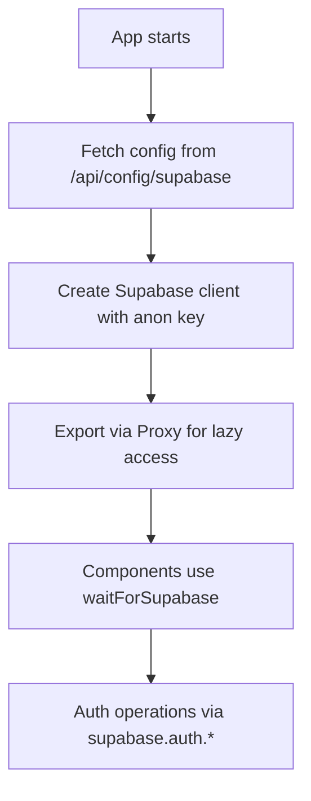

# Client Data Flow

## Overview

The client layer (`frontend/`) is a React 18 application using TanStack Query for server state management, Wouter for routing, and Supabase for authentication. Data flows through a unidirectional pattern: User Action → API Request → Cache Update → UI Re-render.

---

## Application Bootstrap



---

## Core Design Patterns

### 1. Provider Pattern (Context API)

The app wraps all components in nested providers:

```
<QueryClientProvider>        ← Server state management
  <TooltipProvider>          ← UI tooltips
    <UnsavedChangesProvider> ← Form dirty state tracking
      <Router />
    </UnsavedChangesProvider>
  </TooltipProvider>
</QueryClientProvider>
```

### 2. Container/Presentational Pattern

- **Pages** (`pages/`) - Container components that fetch data and manage state
- **Components** (`components/`) - Presentational components that receive props and render UI
- **UI Components** (`components/ui/`) - Pure presentational primitives (shadcn/ui)

### 3. Custom Hooks Pattern

| Hook | File | Purpose |
|------|------|---------|
| `useAuth` | `hooks/useAuth.ts` | Authentication state & session |
| `useToast` | `hooks/use-toast.ts` | Toast notifications |
| `useMobile` | `hooks/use-mobile.tsx` | Responsive breakpoint detection |
| `useUnsavedChanges` | `hooks/use-unsaved-changes.tsx` | Form dirty state tracking |
| `useDialogUnsavedChanges` | `hooks/use-dialog-unsaved-changes.tsx` | Dialog-specific dirty tracking |

---

## Data Fetching Flow



### Query Key Convention

Query keys match API paths for automatic cache management:

```typescript
// Profile data
queryKey: ["/api/profiles", username]

// Nested resources
queryKey: ["/api/profiles", username, "products"]
queryKey: ["/api/profiles", username, "events"]

// Dashboard (authenticated)
queryKey: ["/api/dashboard/profile"]
queryKey: ["/api/dashboard/products"]
```

---

## Authentication Flow



### Auth State Shape

```typescript
interface AuthState {
  user: User | null;          // Supabase User object
  session: Session | null;    // Contains access_token
  isLoading: boolean;         // Initial load state
  isAuthenticated: boolean;   // !!session
}
```

### Protected Route Pattern

```typescript
// In dashboard.tsx
const { isAuthenticated, isLoading } = useAuth();

useEffect(() => {
  if (!isLoading && !isAuthenticated) {
    // Redirect to login
    window.location.href = "/api/login";
  }
}, [isAuthenticated, isLoading]);
```

---

## Mutation Flow (Data Updates)



### apiRequest Helper

```typescript
// lib/queryClient.ts
export async function apiRequest(
  method: string,
  url: string,
  data?: unknown
): Promise<Response> {
  const authHeaders = await getAuthHeaders();

  const res = await fetch(url, {
    method,
    headers: {
      ...authHeaders,
      ...(data ? { "Content-Type": "application/json" } : {}),
    },
    body: data ? JSON.stringify(data) : undefined,
  });

  await throwIfResNotOk(res);
  return res;
}
```

---

## Form Data Flow



### Form Libraries Used

| Library | Purpose |
|---------|---------|
| `react-hook-form` | Form state management |
| `@hookform/resolvers` | Zod integration |
| `zod` | Schema validation |

---

## Unsaved Changes Guard

The `UnsavedChangesProvider` tracks dirty forms across the application:



---

## Component Communication

### Parent to Child (Props)
```typescript
<BookingSection
  sessions={sessions}
  profileId={profile.id}
  username={username}
/>
```

### Child to Parent (Callbacks)
```typescript
<ImageUpload
  onUpload={(url) => form.setValue("imageUrl", url)}
/>
```

### Sibling Communication (Query Cache)
```typescript
// Component A: Invalidate cache
queryClient.invalidateQueries({ queryKey: ["/api/dashboard/products"] });

// Component B: Automatically re-fetches due to shared queryKey
const { data: products } = useQuery({
  queryKey: ["/api/dashboard/products"],
});
```

---

## Routing Architecture

### Route Definitions (App.tsx)

| Route | Page | Auth Required |
|-------|------|---------------|
| `/` | Home | No |
| `/auth` | Auth | No |
| `/auth/callback` | AuthCallback | No |
| `/auth/reset-password` | AuthResetPassword | No |
| `/dashboard` | Dashboard | Yes |
| `/contact` | Contact | No |
| `/:username` | Profile | No |
| `/:username/blog/:slug` | BlogPost | No |
| `/:username/product/:productId` | ProductDetail | No |
| `/:username/event/:eventId` | EventDetail | No |
| `/:username/session/:sessionId` | SessionDetail | No |

### Lazy Loading

All pages are lazy-loaded for code splitting:

```typescript
const Dashboard = lazy(() => import("@/pages/dashboard"));
const Profile = lazy(() => import("@/pages/profile"));
```

---

## External Service Communication

### Supabase Client (`lib/supabase.ts`)



### API Communication (`lib/queryClient.ts`)

All API requests:
1. Wait for Supabase initialization
2. Get current session token
3. Add `Authorization: Bearer <token>` header
4. Handle 401 errors (return null or throw)

---

## State Management Summary

| State Type | Solution | Scope |
|------------|----------|-------|
| Server state | TanStack Query | Global cache |
| Auth state | useAuth hook + Supabase | Global context |
| Form state | React Hook Form | Component local |
| UI state | useState | Component local |
| Dirty tracking | UnsavedChangesContext | Global context |
| Toast notifications | useToast | Global context |

---

## Key Files Summary

| File | Purpose |
|------|---------|
| `main.tsx` | React DOM render entry |
| `App.tsx` | Providers + Router setup |
| `lib/queryClient.ts` | TanStack Query config + apiRequest helper |
| `lib/supabase.ts` | Supabase client initialization |
| `hooks/useAuth.ts` | Authentication state hook |
| `hooks/use-unsaved-changes.tsx` | Form dirty state provider |
| `hooks/use-toast.ts` | Toast notification hook |
| `lib/utils.ts` | Tailwind class merge utility |
