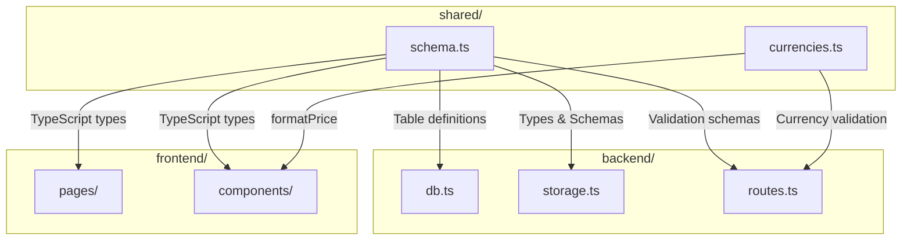
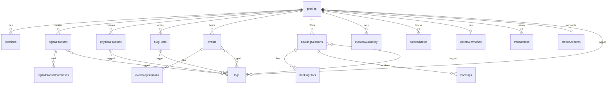
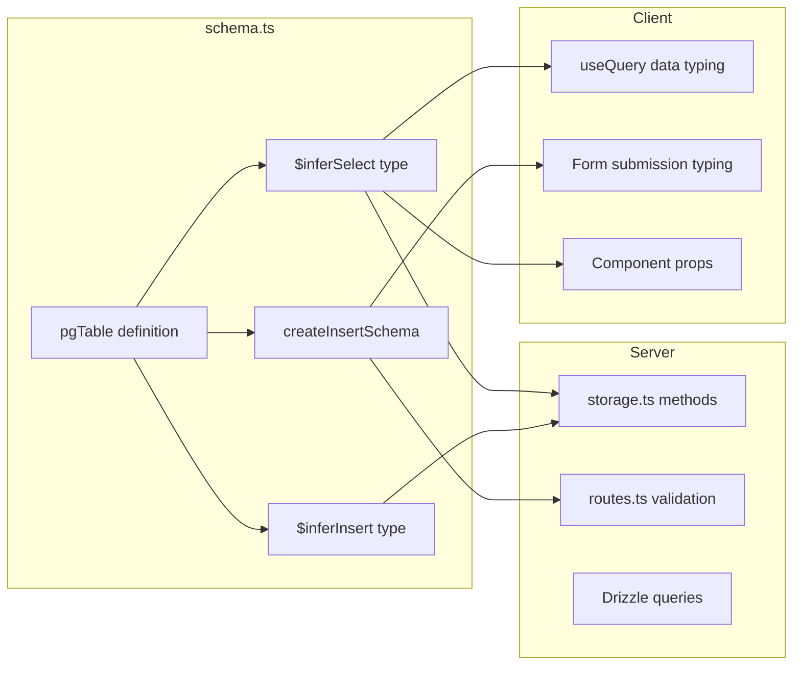

# Shared Layer Data Flow

## Overview

The shared layer (`shared/`) contains code that is used by both the client and server. It serves as the single source of truth for database schema definitions, TypeScript types, and utility functions like currency formatting.

---

## Purpose of the Shared Layer



---

## File Structure

| File | Purpose | Size |
|------|---------|------|
| `schema.ts` | Drizzle ORM table definitions, TypeScript types, Zod validation schemas | ~685 lines |
| `currencies.ts` | Multi-currency support (30 currencies), formatting utilities | ~73 lines |

---

## Schema Architecture

### Design Pattern: Single Source of Truth

The schema file defines three layers for each database entity:

```
1. Table Definition (Drizzle pgTable)
        ↓
2. TypeScript Types (inferred from table)
        ↓
3. Zod Validation Schema (for API input validation)
```

### Example: Digital Products

```typescript
// 1. Table Definition
export const digitalProducts = pgTable("digital_products", {
  id: serial("id").primaryKey(),
  profileId: text("profile_id").references(() => profiles.id).notNull(),
  title: varchar("title").notNull(),
  price: decimal("price", { precision: 10, scale: 2 }).notNull(),
  currency: varchar("currency", { length: 3 }).notNull().default("USD"),
  // ...
});

// 2. TypeScript Types (auto-inferred)
export type DigitalProduct = typeof digitalProducts.$inferSelect;
export type InsertDigitalProduct = typeof digitalProducts.$inferInsert;

// 3. Zod Validation Schema
export const insertDigitalProductSchema = createInsertSchema(digitalProducts).omit({
  id: true,
  createdAt: true,
  updatedAt: true,
});
```

---

## Entity Relationship Diagram



---

## Database Tables

### Core Entities

| Table | Primary Key | Purpose |
|-------|-------------|---------|
| `profiles` | `text` (Supabase UUID) | User profiles (creators) |
| `locations` | `serial` | Saved locations for events/sessions |
| `digitalProducts` | `serial` | Downloadable products (PDF, video, images) |
| `physicalProducts` | `serial` | Physical goods |
| `blogPosts` | `serial` | Blog content |
| `events` | `serial` | Workshops and events |
| `bookingSessions` | `serial` | Bookable session types |

### Booking System

| Table | Purpose |
|-------|---------|
| `bookingSlots` | Available time slots for sessions |
| `bookings` | Confirmed client bookings |
| `eventRegistrations` | Event signups |
| `mentorAvailability` | Weekly recurring availability |
| `blockedDates` | Dates when creator is unavailable |

### Financial System

| Table | Purpose |
|-------|---------|
| `stripeAccounts` | Stripe Connect account info |
| `transactions` | Payment transactions |
| `payouts` | Bank payouts |
| `walletSummaries` | Aggregated earnings data |
| `digitalProductPurchases` | Product purchase records |

### Tagging System

| Table | Purpose |
|-------|---------|
| `tags` | Central tag definitions |
| `sessionTags` | Junction: sessions ↔ tags |
| `eventTags` | Junction: events ↔ tags |
| `digitalProductTags` | Junction: digital products ↔ tags |
| `physicalProductTags` | Junction: physical products ↔ tags |
| `blogPostTags` | Junction: blog posts ↔ tags |
| `profileTags` | Junction: profiles ↔ tags |

---

## Type Flow



---

## JSONB Column Types

The schema uses typed JSONB columns for flexible nested data:

### Profile JSONB Fields

```typescript
// Social links
socialLinks: jsonb("social_links").$type<{
  instagram?: string;
  youtube?: string;
  whatsapp?: string;
  linkedin?: string;
  website?: string;
}>();

// Custom links array
customLinks: jsonb("custom_links").$type<Array<{
  title: string;
  url: string;
  icon?: string;
}>>();

// Gallery images
galleryImages: jsonb("gallery_images").$type<Array<{
  url: string;
  alt: string;
}>>();

// Contact info (nested object)
contactInfo: jsonb("contact_info").$type<{
  phone?: string;
  email?: string;
  location?: { address?: string; city?: string; /* ... */ };
  socialMediaLinks?: Array<{ platform: string; url: string; }>;
  callToAction?: { enableCall?: boolean; /* ... */ };
}>();

// Testimonials
testimonials: jsonb("testimonials").$type<Array<{
  clientName: string;
  content: string;
  rating?: number;
  clientTitle?: string;
}>>();
```

---

## Validation Schemas

### Pattern: Omit Auto-Generated Fields

All insert schemas omit fields that are auto-generated:

```typescript
export const insertProfileSchema = createInsertSchema(profiles).omit({
  createdAt: true,  // Auto-set by defaultNow()
  updatedAt: true,  // Auto-set by defaultNow()
});

export const insertDigitalProductSchema = createInsertSchema(digitalProducts).omit({
  id: true,         // Auto-incremented
  createdAt: true,
  updatedAt: true,
});
```

### Usage in Routes

```typescript
// backend/routes.ts
app.post('/api/dashboard/products', isAuthenticated, async (req, res) => {
  const validatedData = insertDigitalProductSchema.parse({
    ...req.body,
    profileId: getUserId(req),
  });
  const product = await storage.createDigitalProduct(validatedData);
  res.json(product);
});
```

---

## Currency System

### Supported Currencies (30 total)

```typescript
export const SUPPORTED_CURRENCIES: Currency[] = [
  { code: 'USD', name: 'US Dollar', symbol: '$', symbolPosition: 'before' },
  { code: 'EUR', name: 'Euro', symbol: '€', symbolPosition: 'before' },
  { code: 'GBP', name: 'British Pound', symbol: '£', symbolPosition: 'before' },
  // ... 27 more currencies
];
```

### Currency Utilities

| Function | Purpose |
|----------|---------|
| `getCurrency(code)` | Get currency object by code |
| `formatPrice(price, code)` | Format price with symbol (e.g., "$100", "100 kr") |
| `getStripeCurrencyCode(code)` | Convert to Stripe format (lowercase) |
| `isValidCurrency(code)` | Validate currency code |

### Usage Example

```typescript
import { formatPrice } from "@shared/currencies";

// In component
<span>{formatPrice(product.price, product.currency)}</span>
// Output: "$100" or "100 kr" depending on currency
```

---

## Foreign Key Relationships

### Profile as Central Entity

All user-created content references `profiles.id`:

```typescript
digitalProducts.profileId → profiles.id
physicalProducts.profileId → profiles.id
blogPosts.profileId → profiles.id
events.profileId → profiles.id
bookingSessions.profileId → profiles.id
```

### Cascade Deletes

Tag junction tables use cascade deletes:

```typescript
sessionTags.sessionId.references(() => bookingSessions.id, { onDelete: "cascade" })
sessionTags.tagId.references(() => tags.id, { onDelete: "cascade" })
```

---

## Soft Delete Pattern

Most entities use `isActive` boolean instead of hard deletes:

```typescript
export const digitalProducts = pgTable("digital_products", {
  // ...
  isActive: boolean("is_active").default(true),
});

// Query only active products
const products = await db
  .select()
  .from(digitalProducts)
  .where(eq(digitalProducts.isActive, true));
```

---

## Import Patterns

### Server Imports

```typescript
// backend/storage.ts
import {
  profiles,
  digitalProducts,
  type Profile,
  type InsertDigitalProduct,
} from "@shared/schema";
```

### Client Imports

```typescript
// frontend/src/pages/profile.tsx
import type { Profile, BookingSession, DigitalProduct } from "@shared/schema";
import { formatPrice } from "@shared/currencies";
```

---

## Key Files Summary

| File | Exports |
|------|---------|
| `schema.ts` | 20 table definitions, 40+ types, 20+ Zod schemas |
| `currencies.ts` | `SUPPORTED_CURRENCIES`, `formatPrice`, `getCurrency`, `isValidCurrency` |
